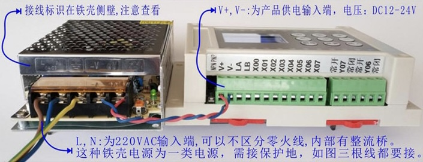

# 简易 PLA 说明文档

## 产品功能特点

- 功能分组：`Z00-15 组`：延时控制；`Z16 组`：日历定时，`Z17 组`：逻辑控制。只需关心自己需要的功能，大大简化使用难度。
 
- 时间精度：延时控制精确到 0.01 秒，日历定时精确到 1 秒，直接输出触发信号。
 
- 延时控制：可每路独立控制，代替 8 个单路时间继电器，比单路继电器更简洁；可多路联合控制，循环任意嵌套，比 PLC 梯形图更简单易用；支持输入等待，条件转移，轻松实现顺序流程和分支控制。
 
- 逻辑控制：支持 `如果`/`与`/`或`、`输出`、`延时`/`定时`、`计数`/`条件转移` 等指令。
 
- 日历定时：支持 `年-月-日-时-分-秒-星期` 定时，可实现任意日历周期 (公历) 定时。并且能与延时控制、逻辑控制结合，实现定时循环，定时允许，限时催款。
 
- 接线简洁：内置 10A 继电器，可直接带电磁阀、接触器、150W 灯泡或电机。
 
- 人机界面：自带简易人机界面，可让用户修改 `延时/计数` 参数而不修改程序。
 
- 程序加密：包含编程密码和人机密码，可以保护程序不被他人修改和查看。

## 产品技术规格

### 输入规格

- 控制器供电：直流 12-24V DC，推荐开关电源供电，**不可用非稳压硅钢片变压器。** 220V AC 供电，内置 12V 2A 开关电源，自带 AC 插头线。
 
- 信号输入：支持按钮，继电器等干接点开关，支持 12-24V DC 电压输入控制；支持接近开关，磁性开关等各种 NPN 或 PNP 开关量输出的传感器。

### 输出规格

- 负载供电：交流 0-220V AC 或直流 0-30V DC。
- 负载电流：内置 10A 继电器 HF46F，可直接控制电磁阀、交流接触器。

### 220V AC 供电产品与 12-24V DC 供电产品的区别与对比

- 220V AC 供电产品：尺寸 145\*90\*72 mm，V+，V- 由内部 12V DC 2A 电源供电。
- 12-24V DC 供电产品：尺寸 145\*90\*40 mm，V+，V- 由外部 12-24V DC 电源供电。


## 产品接线说明

### 总体接线——控制 220V AC 负载


### 总体接线——控制 24V DC 负载，PLC 和负载共用电源


### 总体接线——控制 30V DC 负载，PLC 和负载分别供电


### 接线实例——单相交流电机正反转接线图


### 接线实例——直流电机正反转接线图


### 接线实例——NPN 型开关量输入接线图


### 接线实例——PNP 型开关量输入接线图


## 指令功能介绍

软件都是按 32 路输入，32 路输出设计的，不管实际产品是多少路，程序可设置范围都是 `X00-X31`，`Y00-Y31`。

为了提高多路同时控制效率，支持 `Xxx-xx`，`Yxx-xx` 这种指定端口范围的多路同时控制指令。

### 逻辑控制——Z17 组，160行，可以满足大部分要求

**编程逻辑：如果 xxx 条件满足，那么做 xxx 动作。**

- 如果 xxx 条件：包括 `如果`，`与`，`或` 三条指令，可以实现单个或多个输入条件的逻辑运算组合。
- 做 xxx 动作：包括 `输出`，`计数`，`延时` 等指令，可以实现多种动作控制。

<table>
    <tr>
        <th>指令</th>
        <th>操作对象</th>
        <th>操作参数</th>
    </tr>
    <tr>
        <td rowspan="3">如果、<br />
        与、<br />
        或、</td>
        <td>端口: <br />
        <code>X00-X31</code><br />
        端口: <br />
        <code>Y00-Y31</code></td>
        <td><code>闭合</code>：开关接通；<br />
        <code>断开</code>：开关断开；<br />
        <code>上跳</code>：开关接通瞬间——上升沿；<br />
        <code>下跳</code>：开关断开瞬间——下降沿；</td>
    </tr>
    <tr>
        <td>计数器：<br />
        <code>C00-C99</code></td>
        <td><code>></code>/<code><</code>/<code>=</code>：0000000-9999900 次<br />
        <code>></code>/<code><</code>/<code>=</code>：DC00-DC99，人机界面的计数</td>
    </tr>
    <tr>
        <td>计时器：<br />
        <code>T00-T99</code></td>
        <td><code>></code>/<code><</code>/<code>=</code>：00.00 秒-99:59 时<br />
        <code>></code>/<code><</code>/<code>=</code>：DT00-DT99，人机界面的延时</td>
    </tr>
    <tr>
        <td rowspan="2">输出</td>
        <td>端口：<br /><code>Y00-Y31</code></td>
        <td><code>闭合</code>：开关接通，并自锁；<br />
        <code>断开</code>：开关断开，并自锁；<br />
        <code>点动</code>：开关接通，不自锁；<br />
        <code>反转</code>：开关接通/断开切换；</td>
    </tr>
    <tr>
        <td>程序组：<br />
        <code>Z00-Z17</code></td>
        <td><code>运行</code>：从当前位置启动工作；<br />
        <code>停止</code>：停在程序的开始处；<br />
        <code>暂停</code>：停在当前位置；<br />
        <code>重启</code>：从头开始运行；<br />
        <code>快进</code>：当前延时归零；<br />
        <code>运行/停止</code>：两者切换；<br />
        <code>暂停/运行</code>：两者切换；</td>
    </tr>
    <tr>
        <td>计数</td>
        <td>计数器：<br />
        <code>C00-C99</code></td>
        <td><code>&nbsp;</code>：让 Cxx 计数 0000000-9999999 次；<br />
        <code>=</code>/<code>+</code>/<code>-</code>：给 Cxx 赋值 0000000-9999900 次；</td>
    </tr>
    <tr>
        <td>延时</td>
        <td>计时器：<br />
        <code>T00-T99</code></td>
        <td><code>&nbsp;</code>：让 Txx 计时 00.00 秒-99:59 时<br />
        <code>=</code>/<code>+</code>/<code>-</code>：给 Txx 赋值 00.00 秒-99:59 时<br /><code>:</code>：让 Txx 计时 DTxx，人机界面的延时</td>
    </tr>
</table>

### 延时控制/顺序流程控制——Z00-Z15 组，每组 160 步，可设置很多延时控制
    
#### 编程逻辑

- 通过 "输出 xxx 动作，等 xxx 时间，再做 xxx 动作，再等 xxx 时间"，可以实现任意开关顺序和时间间隔的延时控制；
- 通过 "如果 xxx 条件成立，程序向下执行，否则等待" 实现顺序流程控制；
- 通过 "如果 xxx 条件成立，程序跳转到 xxx 步，否则向下" 实现条件转移控制；
- 通过 "循环 xxx 步 xxxx 次"，实现有限次数的循环控制，循环嵌套控制。

#### 上电选项

- `上电启动`——通电自动从头运行；
- `上电停止`——通电后等待按钮启动或日历定时启动；
- `上电运行`——通电后从上次断电的位置开始运行；
- `上电继续`——通电后继续断电前的状态，是运行就继续运行，是停止就停止。

> 其中 `上电运行`/`上电继续` 是带掉电记忆的，只有 Z00-Z01 组有。

<table>
    <tr>
        <th>指令</th>
        <th>操作对象</th>
        <th>操作参数</th>
    </tr>
    <tr>
        <td rowspan="2">输出</td>
        <td>端口：<br />
        <code>Y00-Y31</code></td>
        <td><code>闭合</code>：开关接通，并自锁；<br />
        <code>断开</code>：开关断开，并自锁；<br />
        <code>翻转</code>：开关接通/断开切换；</td>
    </tr>
    <tr>
        <td>程序组：<br />
        <code>Z00-Z17</code></td>
        <td><code>运行</code>：从当前位置启动工作；<br />
        <code>停止</code>：停在程序的开始处；<br />
        <code>暂停</code>：停在当前位置；</td>
    </tr>
    <tr>
        <td rowspan="2">延时</td>
        <td>立即数：<br />
        <code>00.00 秒-99:59 时</code></td>
        <td>立即数以 0.01 秒精度倒计时；</td>
    </tr>
    <tr>
        <td>定时器：<br /><code>T00-T59</code></td>
        <td><code>&nbsp;</code>：定时器 Txx 以 0.01 秒精度倒计时；<br />
        <code>=</code>/<code>+</code>/<code>-</code>：定时器 Txx 通过 <code>=</code>/<code>+</code>/<code>-</code> 方式赋值；</td>
    </tr>
    <tr>
        <td>计数</td>
        <td>计数器：<br />
        <code>C00-C99</code></td>
        <td><code>&nbsp;</code>：计数器 Cxx 以 1 次为单位计数；<br />
        <code>=</code>/<code>+</code>/<code>-</code>：计数器 Cxx 以 <code>=</code>/<code>+</code>/<code>-</code> 方式赋值；</td>
    </tr>
    <tr>
        <td>如果</td>
        <td>端口：<br />
        <code>X00-X31</code><br />
        端口：<br />
        <code>Y00-Y31</code></td>
        <td><code>闭合</code>/<code>断开-向下</code>：如果条件成立，程序向下，否则等待；<br />
        <code>闭合</code>/<code>断开->xxx步</code>：如果条件成立，程序转 xxx 步，否则向下执行；</td>
    </tr>
    <tr>
        <td>循环</td><td>xxx 行 xxxx 次</td><td>无条件跳转到 xxx 行 xxxx 次</td>
    </tr>
</table>

### 日历定时——Z16 组，160 行，可设置 100 多个时段

#### 编程逻辑

- 先校准系统时间，然后设置定时时段，当系统时间到了定时时段内，就会执行定时后面的动作。
- 当只设置了定时，没有设置定日的话，定时指定的时段每天都有效，或在指定的星期日几下都有效。
- 当只设置了定日，没有设置定时的话，定日指定的时段一天 24 小时都有效。
- 同时设置了定日和定时的话，则两组指定的时段都满足才有效。
- 日历定日和开关量输入输出做简单的与运算，可实现定时允许控制。

<table>
    <tr>
        <th>指令</th>
        <th>操作对象</th>
        <th>操作参数</th>
    </tr>
    <tr>
        <td>校时</td>
        <td>20xx年xx月xx日，<br />
        xx时xx分xx秒</td>
        <td>按北京时间校准，<code>星期x</code>会自动生成，有纽扣电池供电保持。</td>
    </tr>
    <tr>
        <td>定时</td>
        <td>xx时xx分xx秒-xx时xx分xx秒、<br />
        星期0123456</td>
        <td>指定一天内的时段，精确到秒，可选择星期日一二三四五六哪一天有效。</td>
    </tr>
    <tr>
        <td>定日</td>
        <td>20xx-20xx年xx-xx月xx-xx日</td>
        <td>指定年/月/日的时段。</td>
    </tr>
    <tr>
        <td>与</td>
        <td>端口：<br />
        <code>X00-X31</code><br />
        端口：<br />
        <code>Y08-Y31</code></td>
        <td><code>闭合</code>：开关接通；<br />
        <code>断开</code>：开关断开；</td>
    </tr>
    <tr>
        <td rowspan="2">输出</td>
        <td>端口：<br />
        <code>Y00-Y31</code></td>
        <td><code>闭合</code>：时段内闭合，时段外不受控制；</td>
    </tr>
    <tr>
        <td>程序组：<br />
        <code>Z00-Z17</code></td>
        <td><code>运行</code>：时段内运行，时段外不受控制；<br />
        <code>停止</code>：时段内停止，时段外不受控制；</td>
    </tr>
</table>

## 产品使用说明

### 验货测试

当收到产品时，可按下图只给产品供电，不接负载，对产品进行验证测试：



1. 通电后，液晶屏点亮，先显示开机画面，随后进入编程界面，可以看到 `Z17` 组有出厂测试程序。
2. 将 V- 与 `X00-X07` 逐个短路一下，对应的输入指示灯点亮，`Y00-Y07` 跟随闭合，有继电器动作的声音，并且对应输出指示灯点亮，说明输入输出通路正常。

### 清除出厂测试程序

验货测试完成后，需要删除出厂测试程序，以便设置自己需要的功能的程序：产品断电，按住删除键通电，过一会儿放开，便可删除所有程序。

### 编程界面介绍

产品通电后，默认进入编程界面，有三大功能组：`Z00-15` 为延时控制，`Z16` 为日历定时组，`Z17` 为逻辑控制组。在运行状态下，按 `+` 或 `-` 号键，可以切换当前显示哪一组，示例如下图。

|   延时控制组：Z00-Z15 组    |     日历定时组：Z16 组      |     逻辑控制组：Z17 组      |
| :-------------------------: | :-------------------------: | :-------------------------: |
|  |  |  |

> 左边的数字 `000`, `001`, `002`, `...` 代表的是程序步号，大部分指令为 1 步 1 行，也有部分指令为 1 步 2 行的。
>
> 最上面 1 行为表头，标识当前显示的组号，上电状态：`上电启动`，`上电停止`，Z00-01 组还有 `上电运行`，`上电继续`。

### 按键功能介绍——编程界面下：设置一个简单的入门程序

|          按键布局           |       运行状态下功能        |       设置状态下功能        |
| :-------------------------: | :-------------------------: | :-------------------------: |
|  |  |  |

> 产品通电，默认进入编程界面，按一下 `设置/退出` 键，即可进入设置状态；
>
> 如果进入了人机界面，可按 `菜单` 键，选择 `编程界面`，按 `确认` 键，回到编程界面。


> 观察程序执行效果：继电器 `Y00` 闭合 1 秒，断开 1 秒，对应的指示灯跟着亮灭。
>
> 观察程序运行状态：屏幕程序会自动跟随显示当前运行的指令，并且延时时间以 0.01 秒精度倒计时。
>
> 由于我们选择的是 `上电启动`，退出设置状态后，程序就会自动从头运行。
>
> 程序默认**无限循环运行。** 按 `插入/确认` 键，可以控制程序运行/暂停。

### 编程界面按键功能小结

|               运行状态下               |                 设置状态下                 |
| :------------------------------------: | :----------------------------------------: |
|      按 `设置/退出` 进入设置状态       |        按 `设置/退出` 退出设置状态         |
|          按 ⬅️, ➡️ 翻阅程序内容          |            按 ⬅️, ➡️ 左右移动光标            |
|       按 `+`，`-` 切换当前显示组       |            按 ⬆️, ⬇️ 上下移动光标            |
|     按 `菜单/删除` 进入主菜单界面      |      按 `+`，`-` 在光标处修改程序参数      |
| 按 `插入/确认` 启动/暂停当前显示程序组 | 按 `删除`/`插入` 在光标处删除/插入一步程序 |

## 编程案例介绍

所有案例以 8 进 8 出为例

### 延时控制

#### 实例 1.1：每路独立控制

`Z00-Z15` 可以并行工作，将 8 路输出 `Y00-Y07` 分别设置在 `Z00-Z07` 组，可实现每路独立运行，代替 8 个单路时间继电器。并在 `Z17` 组设置每一路的启动停止按钮，如下例，`X00` 启动 `Y00` 输出 1 秒，`X01` 启动 `Y01` 输出 1 分钟，按一下，启动一遍。

```
第 Z17 组：逻辑控制
000 如果 X00 上跳
001 输出 Z00 运行
002 如果 X01 上跳
003 输出 Z01 运行
004--------------
```

```
第 Z00 组：上电停止
000 输出 Y00 闭合
001 延时 01.00 秒
002 输出 Y00 断开
003 输出 Z00 停止
004--------------
```

```
第 Z01 组：上电停止
000 输出 Y01 闭合
001 延时 01:00 分
002 输出 Y01 断开
003 输出 Z01 停止
004--------------
```

#### 实例 1.2：多路联合控制

8 个电磁阀轮流闭合 1 秒，上电启动，无限循环。

```
第 Z00 组：上电启动
000 输出 Y00 闭合
001 延时 01.00 秒
002 输出 Y00 断开
003 输出 Y01 闭合
004 延时 01.00 秒
005 输出 Y01 断开
006 输出 Y02 闭合
007 延时 01.00 秒
008 输出 Y02 断开
009 输出 Y03 闭合
010 延时 01.00 秒
011 输出 Y03 断开
012 输出 Y04 闭合
013 延时 01.00 秒
014 输出 Y04 断开
015 输出 Y05 闭合
016 延时 01.00 秒
017 输出 Y05 断开
018 输出 Y06 闭合
019 延时 01.00 秒
020 输出 Y06 断开
021 输出 Y07 闭合
022 延时 01.00 秒
023 输出 Y07 断开
024--------------
```

##### 程序说明

- 联合控制的程序只要设置到一个延时控制组。这样多个动作才能始终保持同步，不会有累积误差。
- 如果需要，可以在 Z17 组设置 `启动`，`停止`，`暂停` 等控制按钮。

> 本产品可以实现任意开关顺序和时间间隔的延时控制，当延时控制比较复杂时，可借助时序图辅助编程：


> 通过这个时序图，可以很直观的知道开关动作的顺序和时间间隔，转变成程序就会简单很多。

#### 实例 1.3：顺序流程控制

通过输入等待和条件转移指令实现传感器限位控制

```
第 Z17 组：逻辑控制
000 如果 X00 闭合
001 输出 Z00 运行
002 如果 X01 闭合
003 输出 Z00 停止
004--------------
```

##### 程序说明

1. 因为启动按钮只是触发一下，因此要在 `Z17` 组设置，否则要求启动按钮持续闭合，`Z00` 组才能自动循环。
2. 因为停止按钮需要随时中断响应，因此必须设置在 `Z17` 组。

```
第 Z00 组：上电停止
000 输出 Y00 闭合
001 如果 X02 闭合
002 输出 Y01 闭合
003 如果 X03 闭合
004 输出 Y02 闭合
005 延时 03.00 秒
006 如果 x04 闭合->009步
007 输出 Y02 断开
008 如果 X05 闭合
009 输出 Y00-02 断开
010--------------
```

##### 程序说明

- 按下 `X00` 按钮启动后，气缸 `Y00` 伸出；`Y00` 到位后，传感器 `X02` 闭合；
- `X02` 闭合则程序向下运行，气缸 `Y01` 伸出；`Y01` 到位后，传感器 `X03` 闭合；
- `X03` 闭合则程序向下运行，气缸 `Y02` 伸出；`Y02` 到位后，延时 3 秒，如果传感器 `X04` 闭合，直接断开 `Y00-02`；
- 如果 `X04` 没有闭合，先断开 `Y02`，再等待 `X05` 闭合，再断开 `Y00-01`。然后自动进入下一个循环。

#### 实例 1.4：循环控制

```
第 Z17 组：逻辑控制
000 如果 X00 闭合
001 输出 Z00 运行
002 如果 X01 闭合
003 输出 Z00 停止
004--------------
```

```
第 Z00 组：上电停止
000 输出 Y00 闭合
001 延时 01.00 秒
002 输出 Y00 断开
003 输出 Y01 闭合
004 延时 01.00 秒
005 输出 Y01 断开
006 循环 000 行 10000 次
007 输出 Z00 停止
008--------------
```

##### 程序说明

按一下按钮 `X00`，启动 `Z00` 运行：控制 `Y00`，`Y01` 轮流闭合 1 秒，并且运行 10000 次再停止。

##### 注意事项

循环之后仍然要加 `输出 Z00 停止` 才会让程序停下来。

### 日历定时

`Z16` 组，可以设置 160 行程序。

#### 实例 2.1：每天 xx时xx分xx秒-xx时xx分xx秒 输出xx动作，并且可以选择星期几有效

<pre><code>第 Z16 组：日历定时
000 校时 2018-03-30
    星期五 12:00:00<font color="blue">
001 定时 星期0123456
    10:00:00-10:30:00 
002 定时 星期01234566
    12:00:00-13:30:00
003 输出 Y00 闭合</font><font color="red">
004 定时 星期0123456
    15:00:00-15:30:00
005 输出 Y01 闭合
006 输出 Y05 闭合</font>
007--------------</code></pre>

##### 说明

1. 首先用 `校时` 指令，校准系统时间；
2. 然后用 `定时` 指令，设定定时时段；
3. 再用 `输出` 指令，设置要做的动作。

##### 规则

1. 针对同一组动作的多个时段可以并排设置；
2. 针对同一组定时的多个动作也可以并排设置；
3. 一组定时必须定时在先，动作在后。如上面程序，一种颜色代表一组定时。

#### 实例 2.2：每天定时轮流喷水，时段很多，动作有规律

```
第 Z16 组：日历定时
000 时间 2018-03-30
    星期五 12:00:00
001 定时 星期0123456
    08:00:00-08:00:00
002 定时 星期0123456
    10:00:00-10:00:00
003 定时 星期0123456
    12:00:00-12:00:00
004 定时 星期0123456
    15:00:00-15:00:00
005 定时 星期0123456
    18:00:00-18:00:00
006 输出 Z00 运行
007--------------
```

```
第 Z00 组：上电停止
000 输出 Y00 闭合
001 延时 01:00 分
002 输出 Y00 断开
003 输出 Y01 闭合
004 延时 01:00 分
005 输出 Y01 断开
...此处省略 13 行
018 输出 Y06 闭合
019 延时 01:00 分
020 输出 Y06 断开
021 输出 Y07 闭合
022 延时 01:00 分
023 输出 Y07 断开
024 输出 Z00 停止
025--------------
```

##### 说明

- `Y00-Y07` 每天定时轮流喷 5 次，每次轮流喷 1 分钟。
- 如果单纯采用日历定时的话，设置内容很多。采用日定时启动延时控制，可以大大简化程序。
- 定时时段必须小于延时控制总时间，否则会多次启动。
- 延时控制默认是无限循环的，一定要加结束指令 `输出 Z00 停止`。

#### 实例 2.3：路灯定时开关，要求错开上电，错开断电

说明：路灯上电和断电瞬间对电网的冲击较大，要求每路错开 10 秒上电和断电。采用日历定时启动延时控制，即使中途断电再来电，也能每路错开 10 秒启动。 

定时程序：

```
第 Z16 组：日历定时
000 时间 2018-03-30
    星期五 12:00:00
001 定时 星期0123456
    19:00:01-07:00:00
002 输出 Z00 运行
003 定时 星期0123456
    07:00:01-19:00:00
004 输出 Z01 运行
005--------------
```

上电程序：

```
第 Z00 组：上电停止
000 输出 Y00 闭合
001 延时 10:00 秒
002 输出 Y01 闭合
003 延时 10:00 秒
...
012 输出 Y06 闭合
013 延时 10:00 秒
014 输出 Y07 闭合
015 输出 Z00 停止
016--------------
```

断电程序：

```
第 Z01 组：上电停止
000 输出 Y00 断开
001 延时 10:00 秒
002 输出 Y01 断开
003 延时 10:00 秒
......
012 输出 Y06 断开
013 延时 10:00 秒
014 输出 Y07 断开
015 输出 Z01 停止
016--------------
```

#### 实例 2.4：每天定时允许控制，在指定时间内才允许人工控制

```
第 Z16 组：日历定时
000 时间 2018-03-30
    星期五 12:00:00
001 定时 星期0123456
    08:00:00-17:00:00
002  与 X00 闭合
003 输出 Y00 闭合
004--------------
```

##### 说明

通过日历定时和按键输入 `X00` 的 `与` 运算实现定时允许控制功能。

如上程序，每天只有 08:00:00-17:00:00 允许开灯，在该时段内开关闭合亮灯，开关断开灭灯，其他时段开灯开关无效。

#### 实例 2.5：超时催款：指定 20xx-20xx年xx-xx月xx-xx日输出 Z17 停止

```
第 Z16 组：日历定时
000 时间 2018-03-30
    星期五 12:00:00
001 定日 2019-2099年
    01-12月01-31日
002 定日 2018-2018年
    06-12月01-31日
003 输出 Z17 停止
004--------------
```

如上程序，指定 2018 年 6 月开始到 2099 年都停止 `Z17` 组运行。

2018 年要限制的月与 2019 年以后不一样，因此需要另起一条设定。

#### 实例 2.6：节日定时：指定 20xx-20xx年xx-xx月xx-xx日 输出xx动作

```
第 Z16 组：日历定时
000 时间 2018-03-30
    星期五 12:00:00
001 定日 2018-2099年
    05-05月01-03日
002 定日 2018-2099年
    10-10月01-7日
003 定时 星期0123456
    19:00:00-07:00:00
004 输出 Y00 闭合
005--------------
```

如上程序，指定每年的五一节和国庆节晚上输出 `Y00` 闭合。

### 逻辑控制

#### 实例 3.1：点动控制 Y00-Y07

<pre><code>第 Z17 组：输入控制<font color="blue">
000 如果 X00 闭合
001 输出 Y00 点动</font><font color="red">
002 如果 X01 闭合
003 输出 Y01 点动</font>
......<font color="green">
014 如果 X07 闭合
015 输出 Y07 点动</font>
016--------------</code></pre>

##### 说明

这是出厂测试程序，用于测试各端口是否正常。

输入 `X00-X07` 闭合，对应的 `Y00-Y07` 闭合，`X00-X07` 断开，对应的 `Y00-Y07` 也断开。

**Z17 是并行扫描的，连在一起的输入输出指令构成一段控制逻辑，不同逻辑段不分先后。**

如上面程序，不同颜色的两行构成一个逻辑段，不同逻辑段不分先后顺序。

#### 实例 3.2：给延时程序组 Z00-Z15 设置"运行"、"重启"、"停止"、"暂停"等控制按钮

```
第 Z17 组：逻辑控制
000 输入 X00 闭合
001 输出 Z00 运行
002 输入 X01 闭合
003 输出 Z00 重启
004 输入 X02 闭合
005 输出 Z00 停止
006--------------
```

```
第 Z00 组：上电停止
000 输出 Y00 闭合
001 延时 01.00 秒
002 输出 Y00 断开
003 输出 Y01 闭合
004 延时 01.00 秒
005 输出 Y01 断开
006 输出 Z00 停止
007--------------
```

##### 程序说明

`X00` 为启动按钮，`X01` 为重启按钮，`X02` 为停止按钮。

#### 实例 3.3：给程序 Z00-Z15 设置"快进"、"运行/停止"、"暂停/运行" 等控制按钮

```
第 Z17 组：逻辑控制
000 输入 X00 上跳
001 输出 Z00 快进
002 输入 X01 上跳
003 输出 Z00 运行/暂停
004 输入 X02 上跳
005 输出 Z00 暂停/运行
006--------------
```

```
第 Z00 组：上电停止
000 延时 01.00 秒
001 输出 Y00 闭合
002 延时 01.00 秒
003 输出 Y00 断开
004 输出 Y01 闭合
005 延时 01.00 秒
006 输出 Y01 断开
007 输出 Z00 停止
008--------------
```

##### 说明

`快进`、`运行/停止`、`暂停/运行` 都需要设置对应的输入按钮为 `上跳` 或 `下跳`，否则按一下按钮会执行多次指令。

快进可以直接将当前延时归零，主要用于调试时快速确认程序功能。

### 计数器的使用

`C00-C99` 共 100 个，`C00-C02` 掉电记忆。

> 计数对象：
>
> 1. `Z00`, `Z01`, ... 这些程序运行了多少次；
> 2. `X00`, `X01`, ...，`Y00`, `Y01`, ... 这些开关信号输入/输出了多少次。

#### 实例 4.1：程序运行次数记录与控制——带掉电记忆功能

```
第 Z17 组：逻辑控制
000 如果 C00>=1000000 次
001 输出 Z00 停止
002 如果 X00 上跳
003 输出 C00=0000000 次
004 输出 Z00 重启
005--------------
```

```
第 Z00 组：上电运行
000 计数 C00 0000000 次
001 输出 Y00 闭合
002 延时 01.00 秒
003 输出 Y00 断开
004 延时 01.00 秒
005--------------
```

##### 程序说明

- `上电运行` 和 `C00` 都是带掉电记忆功能的，因此产品上电后，会从断电时的状态继续运行，并且次数也会累计。
- 按 `X00`，复位计数和重启。

#### 实例 4.2：X00 输入 5 次，Y00 输出 1 秒，再输入 5 次，Y00 输出 3 秒

```
第 Z17 组：逻辑控制
000 如果 X00 上跳
001 计数 C00 0000000 次
002 如果 C00=0000005 次
003 输出 Z00 运行
004 计数 C00 0000000 次
005 如果 C00>=0000011 次
006 输出 Z01 运行
007 输出 C00=0000000 次
007--------------
```

```
第 Z00 组：上电停止
000 输出 Y00 闭合
001 延时 01.00 秒
002 输出 Y00 断开
003 输出 Z00 停止
004--------------
```

```
第 Z01 组：上电停止
000 输出 Y00 闭合
001 延时 01.00 秒
002 输出 Y00 断开
003 输出 Z01 停止
004--------------
```

##### 程序说明

`C00=0000005 次` 是一个状态，持续时间可能超过 1 秒，那样的话，会导致 `Z00` 被再次触发，因此在 `C00` 再等于 5 次多计数一次，避免重复触发 `Z00` 运行。

#### 实例 4.3：记录产品开机次数，并在人机界面显示

```
第 Z15 组：上电启动
000 计数 C00 0000000 次
001 输出 Z00 停止
002--------------
```

人机界面下设置：

```
运行次数 C00 0000000 次
```

##### 程序说明

`C00 0000000 次`：计数变量 `C00` 后面会自动显示计数次数，但不可修改。

#### 实例 4.4：产品老化测试，并在人机界面设定/显示次数

```
第 Z17 组：
000 如果 C00>=DC00
001 输出 Z00 停止
002 如果 X29 闭合
003 输出 C00=0000000 次
004 如果 X28 上跳
005 输出 Z00 暂停/运行
006--------------
```

```
第 Z00 组：上电启动
000 计数 C00 0000000 次
001 输出 Y00 闭合
002 延时 01.00 秒
003 输出 Y00 断开
004 延时 01.00 秒
005--------------
```

人机界面下设置：

```
设定测试 DC00 1000000 次
运行次数 C00 0000000 次
```

##### 程序说明

人机界面设定运行次数，需要通过变量 `DCxx` 向编程界面传递。在人机界面下，面板上有几个可自定义按键 `X31-X28` 可以当输入按钮使用。

### 计时器的使用

`T00-T99` 共 100 个

#### 实例 5.1：当延时动作比较多，并且需要统一修改时间

```
第 Z00 组：上电启动
000 延时 T00=01.00 秒
001 输出 Y00 闭合
002 延时 T00 00.00 秒
003 输出 Y00 断开
004 输出 Y01 闭合
005 延时 T00 00.00 秒
006 输出 Y01 断开
007 输出 Y02 闭合
008 延时 T00 00.00 秒
009 输出 Y02 断开
010 输出 Y03 闭合
011 延时 T00 00.00 秒
012 输出 Y03 断开
013 输出 Y04 闭合
014 延时 T00 00.00 秒
015 输出 Y04 断开
016 输出 Y05 闭合
017 延时 T00 00.00 秒
018 输出 Y05 断开
019 输出 Y06 闭合
020 延时 T00 00.00 秒
021 输出 Y06 断开
022 输出 Y07 闭合
023 延时 T00 00.00 秒
024 输出 T07 断开
025--------------
```

##### 程序说明

- 这个例子和实例 1.2 是一样的，不过这边先给 `T00` 赋值 01.00 秒，再用 `延时 T00` 来引用这个变量实现延时。
- 如果需要改变这个延时间隔的话，只需要修改赋值语句 `延时 T00=01.00 秒` 就把所有时间间隔都改掉了。

#### 实例 5.2：用输入开关切换延时时间

```
第 Z17 组：逻辑控制
000 如果 X00 闭合
001 延时 T00=01.00 秒
002 如果 X00 断开
003 延时 T00=01:00 分
004--------------
```

##### 程序说明

在例 5.1 中，加上如上所示程序，通过外部按钮 `X00` 闭合或者断开来设定 `T00` 的值是 1 秒还是 1 分钟。可以方便地控制 `Y00-Y07` 轮流打开的时间。

#### 实例 5.3：延时自动变化——运行过程中自动修改延时时间

```
第 Z17 组：逻辑控制
000 输入 X00 闭合
001 输出 Z00 运行
002 如果 T00>=01.00 秒
003 输出 Z00 停止
004 输出 T00=00.00 秒
005--------------
```

```
第 Z00 组：上电停止
000 延时 T00+00.01 秒
001 输出 Y00 闭合
002 延时 T00 00.00 秒
003 输出 Y00 断开
004 延时 T00 00.00 秒
005--------------
```

##### 程序说明

按一下 `X00` 启动 `Z00` 运行，`Y00` 循环开关，时间间隔自动从 0.01 秒逐步增加到 1 秒后停止运行。

#### 实例 5.4：输入抗抖动——X00 输入持续闭合 0.3 秒以上才响应

```
第 Z17 组：逻辑控制
000 输入 X00 闭合
001 输出 T00 00.00 秒
002 如果 T00>=00.30 秒
003 输出 Z00 运行
004--------------
```

##### 程序说明

输入 `X00` 闭合，触发 `T00` 计时，如果 `X00` 断开，`T00` 里面清零。因此只有 `X00` 持续闭合 0.3 秒以上，才能触发 `Z00` 运行。

**在干扰环境很强或 `X00` 按钮接线比较长的时候，可以采用该方法避免 `X00` 误触发。**

#### 实例 5.5：在人机界面上设定和显示延时时间

```
第 Z00 组：上电启动
000 输出 Y00 闭合
001 延时 T00:DT00
002 输出 Y00 断开
003 延时 T01:DT01
004--------------
```

人机界面下设置：

```
设定时间 DT00 01.00 秒
运行时间 T00 00.00 秒
设定时间 DT01 03.00 秒
运行时间 T01 00.00 秒
```

##### 程序说明

人机界面通过 `DTxx` 来向编程界面传递延时时间。`运行时间 Txx 00.00 秒` 会自动跟踪先前当前 `T00`, `T01` 的时间。

## 产品尺寸


